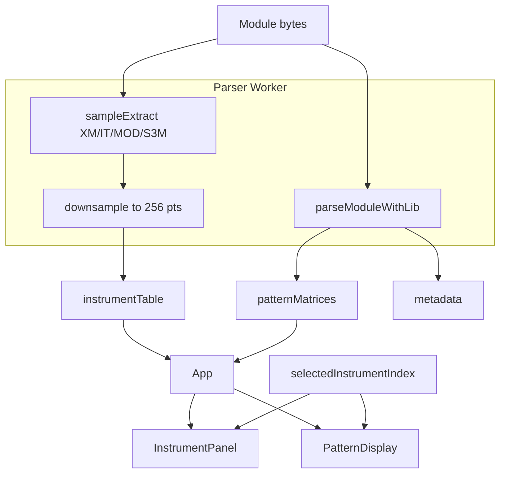

# Instrument Inspector MVP — Implementation Plan

> P2 feature: turn XASM-1 from pattern viewer into module inspector with instrument/sample tables, waveforms, and LED correlation on v0.56+.

## Current foundation

| Asset | Location | Notes |
|-------|----------|-------|
| Instrument names | [`utils/parseModuleWithLib.ts`](../../utils/parseModuleWithLib.ts) | `get_num_instruments` + `get_instrument_name` |
| Sample names (unused) | libopenmpt WASM | `get_num_samples` + `get_sample_name` exported but not wired |
| Name list UI | [`components/MetadataPanel.tsx`](../../components/MetadataPanel.tsx) | Static scroll list, no selection |
| Per-instrument GPU palette | [`utils/instrumentPalette.ts`](../../utils/instrumentPalette.ts) + v0.56 | `paletteMode==1` → `textureLoad(instrumentPalette, inst % 64)` |
| Worker parse path | [`workers/openmpt-parser.worker.ts`](../../workers/openmpt-parser.worker.ts) | Patterns + metadata; main-thread fallback |
| Virtualization pattern | [`components/LibraryPanel.tsx`](../../components/LibraryPanel.tsx) | `@tanstack/react-virtual` already installed |
| Oscilloscope 1D texture | [`hooks/useWebGPURender.ts`](../../hooks/useWebGPURender.ts) binding 6 | Live audio only; not for static waveforms |

**Gap:** libopenmpt WASM exposes **no** sample PCM, length, loop, or middle-C APIs. Waveforms come from **format-specific file parsers** in the worker (user choice).

---

## Architecture



---

## Phase 1 — Types + worker extract (no UI freeze)

### 1.1 Shared types — `types/instruments.ts`

```ts
export interface SampleInfo {
  index: number;          // 1-based tracker index
  name: string;
  length: number;         // frames
  loopStart: number;
  loopEnd: number;
  volume: number;         // 0–64 or format-native, normalized in UI
  finetune: number;
  transpose: number;      // relative note / middle-C offset where applicable
  waveform: Float32Array; // downsampled peaks, length WAVEFORM_POINTS (256)
}

export interface InstrumentInfo {
  index: number;          // 1-based
  name: string;
  sampleIndices: number[]; // linked samples (XM/IT); MOD often 1:1
  volume?: number;
  samples: SampleInfo[];
}

export interface InstrumentTable {
  format: 'mod' | 'xm' | 'it' | 's3m' | 'unknown';
  instruments: InstrumentInfo[];
  samples: SampleInfo[];  // flat list for sample-centric formats
}
```

### 1.2 Format parsers — `utils/sampleExtract/`

| Module | Responsibility |
|--------|----------------|
| `index.ts` | Sniff magic (`XM`, `IMPM`, `SCRM`, `M.K.`) → delegate |
| `mod.ts` | 31 samples, length/loop/volume from MOD header; PCM from file offsets |
| `xm.ts` | Instrument + sample headers; 16-bit PCM |
| `it.ts` | IT sample/instrument envelopes; compressed PCM (bit depth flags) |
| `s3m.ts` | Sample parapointers; ADPCM where flagged |

**Rules:**
- Run entirely in worker (or dedicated `instrument-extract.worker.ts` spawned after pattern parse).
- **Memory budget:** cap total decoded PCM at ~32 MB; skip or stub oversized samples with metadata-only row.
- **Downsample:** min/max envelope per column → `Float32Array(256)` per sample (peaks in [-1, 1]).
- Never post full PCM to main thread — only downsampled peaks + metadata.

### 1.3 Extend worker protocol

Update [`types.ts`](../../types.ts) `WorkerParseMetadata` / `WorkerParseResponse`:

```ts
instrumentTable?: InstrumentTable; // transferable waveform buffers
```

[`workers/openmpt-parser.worker.ts`](../../workers/openmpt-parser.worker.ts):
1. Existing `parseModuleWithLib` (patterns + names).
2. `extractInstrumentTable(fileData, fileName)` — pure bytes, no second WASM module.
3. Progress message: `{ type: 'progress', stage: 'instruments' }`.
4. Post with `instrumentTable` using structured clone (Float32Arrays copy; acceptable at 256 × N samples).

[`hooks/useLibOpenMPT.ts`](../../hooks/useLibOpenMPT.ts):
- `instrumentTable` state, cleared on module load.
- Wire sample names from libopenmpt as fallback when file parser returns `unknown`.

---

## Phase 2 — `InstrumentPanel` UI

### 2.1 Component — `components/InstrumentPanel.tsx`

- Props: `table: InstrumentTable | null`, `selectedIndex`, `onSelect`, `instrumentPalette`, `paletteMode`.
- Virtualized rows via `useVirtualizer` (copy [`LibraryPanel`](../../components/LibraryPanel.tsx) pattern, ~72px row height).
- Each row:
  - Hex index + name (from libopenmpt if parser name empty).
  - Color swatch from `instrumentPalette[(index-1)*4]`.
  - Metadata chips: length, loop, volume (when available).
  - [`components/SampleWaveform.tsx`](../../components/SampleWaveform.tsx) — **Canvas 2D** mini waveform (MVP; WebGPU 1D texture optional later).

### 2.2 Layout integration — [`components/MainLayout.tsx`](../../components/MainLayout.tsx)

- New `Panel` below Metadata or tabbed with Pattern Editor.
- Collapsible on mobile / lite mode.

### 2.3 Selection behavior

- `selectedInstrumentIndex: number | null` in `App.tsx`.
- On select:
  1. Auto-set `paletteMode = 1` when `usesInstrumentPalette(shaderFile)` (v0.52–54, v0.56).
  2. Pass `highlightInstrument` to `PatternDisplay`.
  3. Pulse swatch in panel (CSS animation, 600ms).

---

## Phase 3 — GPU LED correlation (v0.59)

Do **not** patch v0.56 in place. Add registry entry per project conventions.

### 3.1 Shader — `shaders/patternv0.59.wgsl`

Copy v0.56 body; add uniform:

```wgsl
highlightInstrument: u32,  // slot 33 — 0=off, else 1-based inst index
```

In middle emitter block (after `paletteMode` branch):

```wgsl
if (uniforms.highlightInstrument > 0u) {
  if (inst != uniforms.highlightInstrument) {
    midIntensity *= 0.12;
  } else {
    midIntensity *= 1.6;
  }
}
```

Register in [`utils/shaderRegistry.ts`](../../utils/shaderRegistry.ts) with `instrumentPalette: true`, `instrumentHighlight: true`.

### 3.2 Host wiring

- [`utils/gpuPacking.ts`](../../utils/gpuPacking.ts) — `highlightInstrument?: number` at `uint[33]` in extended layout.
- [`hooks/useWebGPURender.ts`](../../hooks/useWebGPURender.ts) — pass through render params.
- [`components/PatternEditor.tsx`](../../components/PatternEditor.tsx) — dim/highlight `inst` column cells matching selection (DOM fallback for HTML renderer).

### 3.3 App config

Add to [`appConfig.ts`](../../appConfig.ts) `SHADER_GROUPS` Circular: `v0.59 (Instrument Highlight)`.

---

## Phase 4 — Optional sample preview (stretch)

- `hooks/useSamplePreview.ts`: play `SampleInfo.waveform` resynthesized from stored peaks **or** decode snippet on demand in worker → `AudioBuffer` (better fidelity).
- Preview button on row; does not seek pattern playback.
- Guard: one voice at a time, stop on second click.

**Defer** until acceptance criteria met without it.

---

## Acceptance mapping

| Criterion | Implementation |
|-----------|----------------|
| Multi-instrument IT/XM shows names + waveforms | Worker file parser + `InstrumentPanel` |
| Selection correlates with v0.56 LEDs | `paletteMode=1` + v0.59 `highlightInstrument` dim/boost |
| Large modules don't freeze | Worker extract + virtualized list + downsampled peaks only |

---

## Test plan

**Automated**
- `tests/sampleExtract/mod.test.ts` — known `.mod` fixture: sample count, length, 256-point waveform shape.
- `tests/sampleExtract/xm.test.ts` — `public/test.xm` or bundled fixture.
- `tests/instrumentHighlight.test.ts` — `fillUniformPayload` slot 33.
- `npm run test:shader-registry` after v0.59 registration.

**Manual**
1. Load IT/XM with 20+ instruments → panel scrolls smoothly, waveforms visible.
2. Select instrument → v0.59 LEDs boost matching cells, others dim; palette swatch pulses.
3. Load 50+ instrument module → no main-thread jank during load (DevTools Performance).
4. Offline: `public/libmpt/` + local `.mod` — no CDN required.

---

## File touch list (estimated ~1.2k LOC)

| File | Action |
|------|--------|
| `types/instruments.ts` | New |
| `utils/sampleExtract/{index,mod,xm,it,s3m}.ts` | New |
| `utils/parseModuleWithLib.ts` | Add sample name fallback |
| `workers/openmpt-parser.worker.ts` | Instrument extract stage |
| `types.ts` | Extend worker types |
| `hooks/useLibOpenMPT.ts` | `instrumentTable` state |
| `components/InstrumentPanel.tsx` | New |
| `components/SampleWaveform.tsx` | New |
| `components/MainLayout.tsx` | Panel slot |
| `App.tsx` | Selection state + props |
| `shaders/patternv0.59.wgsl` | New |
| `utils/shaderRegistry.ts` | Meta |
| `appConfig.ts` | Picker entry |
| `utils/gpuPacking.ts` | Uniform slot 33 |
| `hooks/useWebGPURender.ts` | Pass highlight |
| `components/PatternDisplay.tsx` | Prop drill |
| `tests/sampleExtract/*.test.ts` | Fixtures |

---

## Risks and mitigations

| Risk | Mitigation |
|------|------------|
| IT compressed samples complex | Start MOD + XM; IT in phase 1b with `test.xm`/`test.it` fixtures |
| Instrument vs sample index mismatch | Document 1-based indices; match tracker convention in pattern cells (`inst` byte) |
| Uniform layout drift | Extend via registry + `fillUniformPayload` test; never `shaderFile.includes` |
| WASM libopenmpt still name-only | File parser is source of truth for PCM; lib names as merge fallback |

---

## Suggested implementation order

1. `types/instruments.ts` + MOD parser + unit test (prove worker path)
2. Worker integration + `useLibOpenMPT` state
3. `InstrumentPanel` + Canvas 2D waveform (read-only)
4. Selection → `paletteMode` + PatternEditor highlight
5. v0.59 shader + uniform wiring
6. XM/IT parsers
7. Sample preview (optional)
